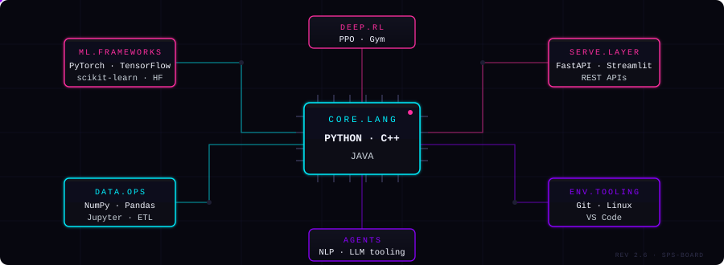

<!-- ============================================================
     SURYA PRATAP SINGH · profile README
     All banner/divider/stack/timeline art = hand-built animated
     SVG in ./assets — pure SMIL, no generators, no JS.
     ============================================================ -->

<div align="center">
  
</div>

<div align="center">

  [](https://Surya97141.github.io)
  [](https://linkedin.com/in/surya-singh-b575591b5)
  [](mailto:pratap742006@gmail.com)
  [](https://github.com/Surya97141)
  

</div>


## About


CS undergrad at **AKTU** (Data Science,2024–2028), building at the intersection of software engineering, machine learning, and autonomous AI systems.

Two things on the bench right now: **MAIRA** — an agent that audits ML research codebases for reproducibility gaps — and a **Deep RL** multi-agent aerial combat environment built from scratch.

- 🔭 Working on — `MAIRA` · `DRL Aerial Combat Sim`
- 🌱 Learning — LLM fine-tuning · agentic frameworks · production ML
- 💬 Ask me about — Python · scikit-learn · Deep RL · NLP pipelines
- ⚡ Open to — SWE · ML Engineering · AI Agent internships
- 📫 [pratap742006@gmail.com](mailto:pratap742006@gmail.com)

<br clear="right"/>


## Projects

| Project | Description | Stack | Status |
|---------|-------------|-------|--------|
| [**MAIRA**](https://github.com/Surya97141/MAIRA) | AI agent that audits ML codebases — surfaces missing ablations, baseline gaps, unreported hyperparameters | Python · NLP · Static Analysis | `Active` |
| [**DRL Aerial Combat**](https://github.com/Surya97141/DRL-Aerial-Combat) | Custom OpenAI Gym multi-agent RL environment for autonomous aerial combat, from scratch | Python · Gym · PPO | `Active` |
| **SentinelAI** | Real-time fake news detection — TF-IDF + cosine similarity + zero-shot classification | HuggingFace · Streamlit | `Shipped` |
| **Mental Health Predictor** | End-to-end supervised pipeline with SMOTE, benchmarked across LR / RF / GBM | scikit-learn · Pandas | `Shipped` |
| **Flood Prediction** | Disaster-risk prediction, ETL + geospatial dashboard — Smart India Hackathon | scikit-learn · Streamlit | `Shipped` |


## Stack

<div align="center">
  
</div>


## Mission Log

<div align="center">
  
</div>


## GitHub Stats

<div align="center">
  
  
</div>

<div align="center">
  
</div>

<div align="center">
  
</div>

<div align="center">
  
</div>


## Contribution Snake

<div align="center">
  
</div>

<details>
<summary><b>🖥️ click to open a terminal</b></summary>
<br>

```bash
surya@neon-city:~$ whoami
ml-engineer, ai-systems-builder, sophomore-at-aktu

surya@neon-city:~$ cat current_focus.txt
MAIRA               → auditing ML codebases for reproducibility gaps
DRL-Aerial-Combat   → multi-agent PPO in a custom OpenAI Gym env

surya@neon-city:~$ ./run_status_check.sh
[OK] caffeine level     : nominal
[OK] open to work       : true
[OK] response time      : < 24h

surya@neon-city:~$ echo "thanks for stopping by :)"
thanks for stopping by :)
```

</details>


<div align="center">
  <sub>
    <i>build things that work. then make them work better.</i>
    &nbsp;·&nbsp;
    <a href="https://Surya97141.github.io">portfolio</a>
    &nbsp;·&nbsp;
    <a href="https://linkedin.com/in/surya-singh-b575591b5">linkedin</a>
    &nbsp;·&nbsp;
    <a href="mailto:pratap742006@gmail.com">email</a>
  </sub>
</div>
